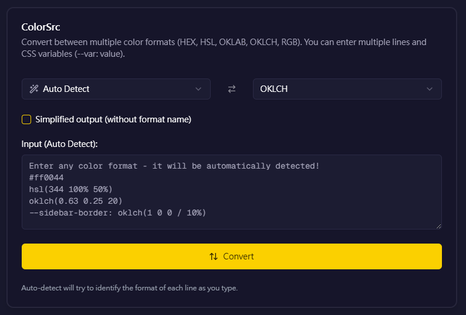

# ColorSrc

<p align="center">
  
</p>

A powerful tool for converting between multiple color formats. Built with Next.js, Shadcn UI, and Framer Motion.

[](https://colorsrc.vercel.app)
[](https://github.com/yorukot/colorsrc)
[](LICENSE)

<p align="center">
  
</p>

## Table of Contents

- [Overview](#overview)
- [Features](#features)
- [Installation](#installation)
- [Usage](#usage)
- [Color Format Support](#color-format-support)
- [Examples](#examples)
- [Advanced Features](#advanced-features)
- [Contributing](#contributing)
- [License](#license)
- [Acknowledgements](#acknowledgements)

## Overview

ColorSrc is a modern web application for converting between various color formats used in web development and design. It combines powerful color conversion algorithms with an intuitive, user-friendly interface to streamline workflow for developers and designers.

Whether you're migrating from traditional RGB/HSL colors to modern OKLCH format, or need to convert colors for different design systems, ColorSrc has you covered with accurate conversions and a sleek interface.

<p align="center">
  
</p>

## Usage

<p align="center">
  
</p>

1. **Select Formats**:
   - Choose your source format (or use Auto Detect)
   - Select your target format
   - Use the swap button (↔️) to quickly switch between formats

2. **Input Colors**:
   - Enter one or more color values
   - Support for multiple lines and CSS variables
   - Auto-detection works as you type

3. **Conversion**:
   - Click "Convert" to process the input
   - Results appear in the output section
   - Use the "Copy" button to copy all results to clipboard

4. **Simplified Output**:
   - Toggle the "Simplified output" checkbox to remove format names
   - Example: `0.63 0.25 20` instead of `oklch(0.63 0.25 20)`

## Color Format Support

### HEX
Standard hexadecimal notation used in CSS and design tools.
- **Supported Formats**:
  - `#RGB`
  - `#RGBA`
  - `#RRGGBB`
  - `#RRGGBBAA`
- **Example**: `#ff0044`, `#f04`, `#ff0044cc`

### HSL
Hue, Saturation, Lightness format that's intuitive for humans.
- **Supported Formats**:
  - `hsl(h s% l%)`
  - `hsl(h s% l% / a)`
  - `h s% l%` (raw values)
- **Example**: `hsl(344 100% 50%)`, `hsl(344 100% 50% / 0.5)`, `344 100% 50%`

### OKLAB
Perceptually uniform LAB color space for more accurate color manipulation.
- **Supported Formats**:
  - `oklab(l a b)`
  - `oklab(l a b / a)`
  - `l a b` (raw values)
- **Example**: `oklab(0.63 0.24 0.09)`, `oklab(0.63 0.24 0.09 / 0.8)`, `0.63 0.24 0.09`

### OKLCH
Perceptual color space with intuitive cylindrical coordinates.
- **Supported Formats**:
  - `oklch(l c h)`
  - `oklch(l c h / a)`
  - `l c h` (raw values)
- **Example**: `oklch(0.63 0.25 20)`, `oklch(0.63 0.25 20 / 0.9)`, `0.63 0.25 20`

### RGB
Classic Red, Green, Blue format widely used in web and design.
- **Supported Formats**:
  - `rgb(r g b)`
  - `rgb(r g b / a)`
  - `r g b` (raw values)
- **Example**: `rgb(255 0 68)`, `rgb(255 0 68 / 0.5)`, `255 0 68`

## Examples

### Converting CSS Variables
ColorSrc intelligently preserves CSS variables while converting their values:

```css
/* Input (HSL) */
--primary: 220 100% 50%;
--secondary: 280 75% 60%;
--text: 0 0% 10%;

/* Output (OKLCH) */
--primary: oklch(0.57 0.23 260);
--secondary: oklch(0.65 0.20 305);
--text: oklch(0.20 0.00 0);
```

### Batch Converting Color Palettes
Process entire color schemes at once:

<p align="center">
  
</p>

### Converting with Alpha Values
ColorSrc fully supports alpha (transparency) channel:

```css
/* Input */
--overlay: rgba(0, 0, 0, 0.5);
--glass: hsla(200, 100%, 50%, 0.2);
--border: oklch(1 0 0 / 10%);

/* Output */
--overlay: oklch(0.00 0.00 0 / 50%);
--glass: oklch(0.63 0.20 233 / 20%);
--border: rgb(255 255 255 / 10%);
```

## Advanced Features

### Simplified Output Mode
Toggle the simplified output checkbox to get values without format names - useful for variable assignments or when you only need the values:

<p align="center">
  
</p>

### Auto-Detection
The Auto Detect feature can identify most color formats without manual selection:

<p align="center">
  
</p>

### Progressive Web App
ColorSrc can be installed as a Progressive Web App for offline use:

<p align="center">
  
</p>

## Installation

### Prerequisites

- Node.js 18.x or higher
- npm, yarn, or pnpm package manager

### Setup

1. Clone the repository:

```bash
git clone https://github.com/yorukot/colorsrc.git
cd colorsrc
```

2. Install dependencies:

```bash
pnpm install
# or
npm install
# or
yarn install
```

3. Start the development server:

```bash
pnpm dev
# or
npm run dev
# or
yarn dev
```

4. Open [http://localhost:3000](http://localhost:3000) in your browser to see the application.

## License

This project is licensed under the MIT License - see the [LICENSE](LICENSE) file for details.

## Acknowledgements

- Color conversion algorithms provided by [Colorizr](https://github.com/gilbarbara/colorizr)
- UI components from [Shadcn UI](https://ui.shadcn.com/)
- Animations powered by [Framer Motion](https://www.framer.com/motion/)
- Icons from [Lucide Icons](https://lucide.dev/)
- Created with [Next.js](https://nextjs.org/)

---

<p align="center">
  Built with ❤️ by <a href="https://github.com/yorukot">Yorukot</a>
</p>

@layer base {
    :root {
      --background: 142 40% 98%;
      --foreground: 142 67% 0%;
      --radius: 0.5rem;
    }
  
    .dark {
      --background: 142 33% 3%;
      --foreground: 142 36% 97%;
      --muted: 112 25% 15%;
      --destructive-foreground: oklch(0.93 0.03 25/70);
    }
  }
  
  